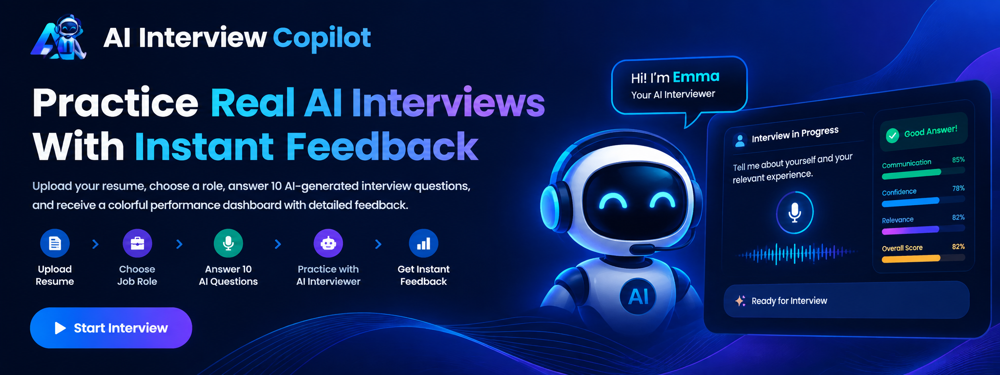

# 🤖 AI Interview Copilot

<p align="center">
  
</p>

AI Interview Copilot is a full-stack AI-powered interview practice platform built with Flask and Google Gemini.
An AI-powered virtual interview coach that conducts face-to-face mock interviews using voice interaction, webcam recording, AI-generated follow-up questions, and a professional performance dashboard.

🚀 Live Demo

https://ai-interview-copilot-v3.onrender.com

## 🚀 Features

- 🎥 Live Webcam Interview
- 🎙 Voice-based Conversation
- 🤖 AI Interviewer (Gemini + Offline Fallback)
- ⏱ 2 min 30 sec Question Timer
- ⏭ Skip/Next Question
- 📜 Live Speech Transcript
- 📊 Performance Dashboard
- 💪 Strength & Weakness Analysis
- 🗣 Communication Score
- 💻 Technical Score
- 📈 Confidence Timeline
- 🎥 Interview Recording
- 💾 SQLite Interview History

## 🛠 Tech Stack

- Python
- Flask
- Google Gemini API
- JavaScript
- HTML
- CSS
- SQLite
- PyPDF2

## 📁 Project Structure

```text
AI-Interview-Copilot/
├── app.py
├── interview_engine.py
├── requirements.txt
├── .env
├── database/
├── uploads/
├── reports/
├── static/
│   ├── css/style.css
│   ├── js/app.js
│   ├── js/analytics.js
│   └── js/avatar.js
└── templates/
    ├── index.html
    ├── interview.html
    └── result.html~
